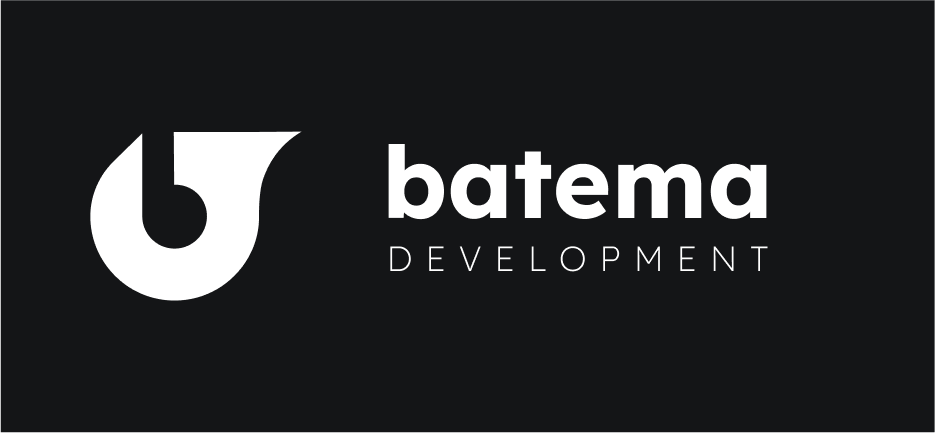

---
<h1 align="center">Lukas Batema</h1>
<h3 align="center">BatemaDevelopment | Keeping Code Public | Established: January 17, 2021</h3>
<h6 align="center">Founder of BatemaDevelopment, and a Jedi Master.</h6>

  

  

- 💬 Ask me about **HTML5, JS, and CSS3**

- ⚡ Fun fact **I have been cubing since 5th grade and programming since 6th. I am now in 12th grade.**

&nbsp;

### Recent Activity
<!--START_SECTION:activity-->
<!--END_SECTION:activity-->
